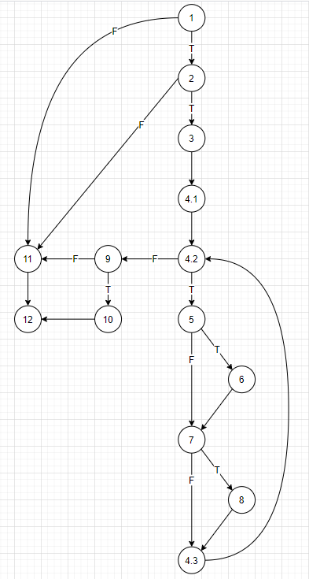

# Втора лабораториска вежба по Софтверско инженерство
## Андреј Мрчески, број на индекс: 186051
### Група на код:
Ја добив групата на код 1
### Control Flow Graph

### Цикломатска комплексност
Цикломатската комплексност на овој код е 7, која ја пресметав со формулата E - N + 2, каде E е бројот на ребра (edges) во графот, а N претставува бројот на јазли. Во овој случај E = 19 и N = 14 => комплексноста е 19 - 14 + 2 = 7
### Тест случаи според критериумот Every statement
Секој statement е опфатен со следните два тест случаи:
1. Влезните аргументи во функцијата се:
    user = null, allUsers = { "Stefan", "Marija", "Bojan" }
    Јазли кои се изминуваат: 1, 11, 12

2. Влезните аргументи во функцијата се:
    user = { username = "Andrej", password = "abcd1234", email = "andrej.mrceski@gmail.com" }, allUsers = { "Stefan", "Marija", "Bojan" }
    Јазли кои се изминуваат: 1, 2, 3, 4.1, 4.2, 5, 6, 7, 8, 9, 10, 12

### Тест случаи според критериумот Every path
Според цикломатската комплексност на овој код има 7 патеки. Наредните тест случаи ги изминуваат сите патеки:
1. Тест случај: user = null; allUsers = { "Stefan", "Marija", "Bojan" }
   Патека: 1, 11, 12

2. Тест случај: user = { username = "Andrej"; password = "abcd1234"; email = "andrej.mrceski@gmail.com" }; allUsers = { "Andrej", "Stefan", "Marija", "Bojan" }
   Патека: 1, 2, 11, 12

3. Тест случај: user = { username = "Andrej"; password = "abcd1234"; email = "" }; allUsers = { "Stefan", "Marija", "Bojan" }
   Патека: 1, 2, 3, 4.1, 4.2, 9, 11, 12

4. Тест случај: user = { username = "Andrej"; password = "abcd1234"; email = "andrej.mrceski.com" }; allUsers = { "Stefan", "Marija", "Bojan" }
   Патека: 1, 2, 3, 4.1, 4.2, (5, 7, 4.3, 4.2), 9, 11, 12
   
5. Тест случај: user = { username = "Andrej"; password = "abcd1234"; email = "andrej.mrceski@gmailcom" }; allUsers = { "Stefan", "Marija", "Bojan" }
   Патека: 1, 2, 3, 4.1, 4.2, (5, 6, 7, 4.3, 4.2), 9, 11, 12
   
6. Тест случај: / - нема тест случај кој ќе ја измини оваа патека од јазли, бидејќи за да се премини од јазелот 7 кон јазелот 8, потребно е јазелот 6 веќе да припаѓа на патеката.
   Патека: 1, 2, 3, 4.1, 4.2, (5, 7, 8, 4.3, 4.2), 9, 11, 12
   
7. Тест случај: user = { username = "Andrej"; password = "abcd1234"; email = "andrej.mrceski@gmail.com" }; allUsers = { "Stefan", "Marija", "Bojan" }
   Патека: 1, 2, 3, 4.1, 4.2, (5, 6, 7, 8, 4.3, 4.2), 9, 10, 12

### Објаснување на напишаните unit tests
Најпрвин го изработив Control Flow графот од кој можев да ја испишам секоја патека (секвенца од јазлите).
#### 1. Тест случаи според критериумот Every Statement (објаснување):
Според овој критериум треба да биде изминат секој statement, односно секој програмски јазел. Со споредба на претходно испишаните патеки лесно може да се забележи ако барем еден од предикатните јазли 1, 2, 4.2, 5, 7 не го исполнува условот, тогаш патеката ќе поминува низ јазелот 11 и ќе терминира во 12, а доколку сите овие јазли ги исполнат условите тогаш патеката ќе минува низ јазелот 10 и ќе терминира во 12. Како наједноставен тест случај одлучив предикатниот јазел 1 да не го исполнува условот како прв тест случај (тоа важи само кога објектот user = null) и овој тест случај ги вклучува јазлите 1, 11 и 12. Како втор тест случај останува сите предикатни јазли да ги исполнат условите, така што се добива вториот тест случај (валидни вредности за променливите на објектот user). За првиот тест случај влезниот аргумент, листата allUsers нема никакво влијание врз резултатот, па затоа може да има секаква вредност. Додека во вториот случај оваа листа, треба да биде листа од променливата string, така што нема да го содржи string-от со иста вредност како и променливата username од објектот user.

#### 2. Тест случаи според критериумот Every Path (објаснување):
Бидејќи веќе ги имав патеките, потребно беше да се испишат тест случаеви за чии вредности ќе се изминуваат соодветните патеки. За првата и последната патека веќе ги имав случаевите од Every statement, останаа уште 4 патеки (една од патеките не може да биде измината и е невалидна патека, објаснето претходно).
За втората патека потребно беше предикатниот јазел 2 да не го исполнува условот. Условот кај овај јазел е сложен услов од 3 прости услови поврзани со логичкиот оператор И, така што доволно е еден од условите да не е исполнет. Одлучив условот кој нема да биде исполнет, да биде условот вредноста на променливата username од објектот user да ја има како елемент во листата allUsers.
За третата патека потребно е да не биде исполнет условот на предикатниот јазел од циклусот for уште на самиот почеток, со што се добива случајот со празен string како вредност на променливата email од user, додека променливата username мора да има валидна вредност на string и allUsers да биде листа од string која што нема да ја содржи вредноста на username.
Четвртата патека се добива за тест случајот слично како за третата патека само што променливата email од user е потребно да биде string со должина поголема од 0 и да не го содржи знакот '@'.
Петтата патека се добива исто како претходните два случаеви само овој пат променливата email го содржи знакот '@', но нема да го содржи знакот '.' после знакот '@'.
Со овие случаеви се изминати сите 6 валидни патеки.
